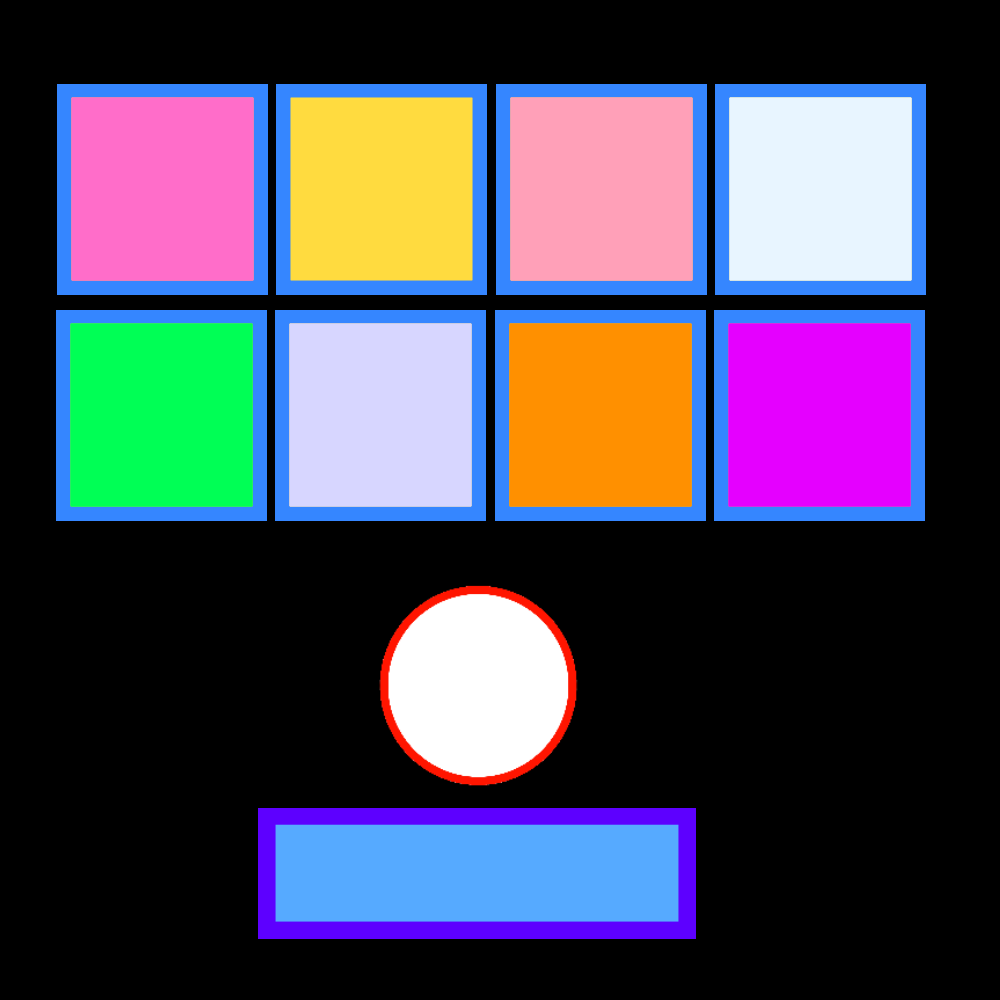

# Brick Breaker

**Brick Breaker** is a Breakout clone which the player must smash a wall of bricks by deflecting a bouncing ball with a paddle. The paddle may move horizontally and is controlled with the keyboard arrows keys.

   

## How to play?

The player moves a racket from side to side to hit the ball. The goal of the game is to eliminate all the bricks at the top of the screen by hitting them with the ball

<table border="1" cellspacing="0">
 <tr>
  <th>Racket</th>
  <th>Ball</th>
  <th>Brick</th>
 </tr>
 <tr>
  <td>
   
  </td>
  <td>
   
  </td>
  <td>
   
  </td>
 </tr>
</table>

### Gallery

<table border="1" cellspacing="0">
 <tr>
  <td>
   
  </td>
   <td>
   
  </td>
  <td>
   
  </td>
 </tr>
 <tr>
  <td>
   
  </td>
   <td>
   
  </td>
 </tr>
</table>
