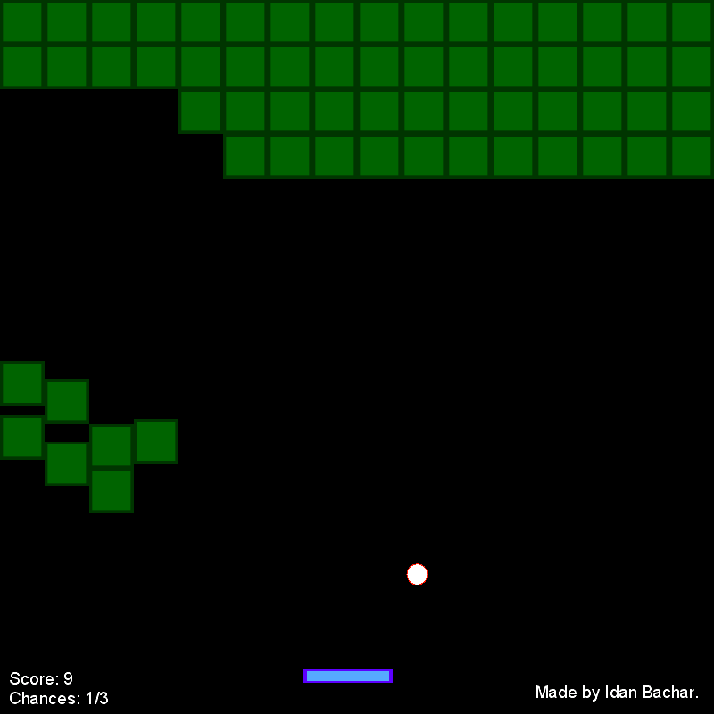

# Brick Breaker

## What is Brick Breaker?

**Brick Breaker** is just a basic 'Brick Breaker' game, with a bit of additions.
 
Only fast reaction players have a chance to win.

-Click image below to watch the gameplay video:

## Rules/How to play

-**Your character** in the game is racket:

 
 

-There are **blocks you need to hit with the moving ball**:

 | Object | Image |
| ------ | ------ |
| Ball |  |
| Block |  |

In this game, blocks you hit falls on you and give you damage.
 
The goal is to make the ball hit at the top of the game's window.

## Screenshots Gallery

## Credits

Game developed by <a href="https://www.linkedin.com/in/idanbachar/">Idan Bachar</a>.

© 2021 Idan Bachar All Rights Reserved.
